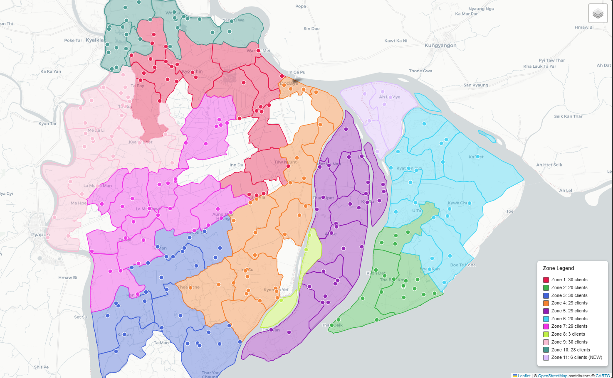

# DSGA — Density-Seeded Growth with Annealing

A custom geospatial algorithm for assigning delivery clients to balanced, contiguous employee zones using administrative ward boundaries and actual road distances.



## The Problem

Standard clustering and routing algorithms (K-Means, HDBSCAN, VRP solvers) each solve part of the delivery zone problem but fail to satisfy all my operational constraints simultaneously:

| Constraint | What It Means | Why Off-the-Shelf Fails |
|---|---|---|
| **Farm-rooted routes** | Every employee starts and ends at the farm | Clustering ignores origin points |
| **No dropped deliveries** | Every client must be assigned | HDBSCAN labels points as noise |
| **Balanced workload** | Even client distribution across zones | K-Means optimizes compactness, not balance |
| **Road-aware geography** | Zones follow road networks, not straight lines | K-Means/K-Medoids use Euclidean distance |
| **Scalable** | New clients slot in without full re-clustering | VRP recalculates everything from scratch |
| **Relationship continuity** | Same employee serves same clients for months | Route optimizers shuffle assignments constantly |

## The Approach

Instead of clustering individual GPS points, DSGA operates on **administrative wards** — contiguous geographic polygons that already have clean boundaries. Each client inherits the zone of its ward.

This abstraction reduces the problem from ~400 individual clients to ~80 wards, making it tractable while guaranteeing geographic coherence.

## Algorithm Phases

```
Phase 1 (Adjacency) → BFS from each client ward to build a client-ward graph
Phase 2 (Seed)      → Density × distance scoring to place initial zone seeds
Phase 3 (Grow)      → Smallest-first growth with quadratic size penalty
Phase 4 (Balance)   → Push, pull, and chain transfers between neighboring zones
Phase 5 (Anneal)    → Simulated annealing for final optimization
Phase 6 (Assign)    → Map ward-level zones back to individual clients
```

### Phase 1 — Connection Map
BFS from each client ward through the full ward polygon graph. Connects client wards that are geographic neighbors, optionally traversing empty (no-client) intermediate wards.

### Phase 2 — Density-Aware Seed Selection
Selects zone seeds using a combined score: `min_distance_to_existing_seeds × density_potential`. This ensures seeds are both well-separated and placed in client-dense areas — unlike pure furthest-first seeding which ignores density.

### Phase 3 — Size-Penalized Growth
Zones grow outward from seeds, smallest-first. A quadratic penalty inflates perceived distances for oversized zones, making them yield nearby wards to smaller zones.

### Phase 4 — Balancing via Ward Transfers
Three mechanisms equalize zone sizes: **push** (large → small), **chain transfer** (cascade through intermediate zones), and **pull** (small grabs from large). A cooldown prevents ping-pong oscillation.

### Phase 5 — Simulated Annealing
Randomly proposes boundary ward swaps, scoring on balance (10× weight) and compactness. Accepts worse moves early to escape local optima, then converges. Tracks and restores the best state across 100K iterations.

### Phase 6 — Client Assignment
Maps ward-level zones to individual clients. Nearest-neighbor fallback (by road distance) handles any unassigned edge cases.


## Usage

```python
from WardZones_v7 import WardZoneAssignment

zoner = WardZoneAssignment(
    mapper=mapper,                        # WardMapper (already mapped clients)
    adjacency_builder=adjacency_builder,  # WardAdjacency (already built adjacency)
    locations=locations,                  # List[Location] — office at index 0
    road_matrix=road_matrix,              # np.ndarray — OSRM road distance matrix
    n_zones=14,                           # Number of employee zones
    empty_connecting_ward_allowance=0     # Max empty wards to traverse between client wards
)

zoner.assign_zones()
zoner.visualize_zones(filename="Output/ward_zones_v7.html")
```

### Key Parameters

| Parameter | Default | Description |
|---|---|---|
| `n_zones` | `14` | Number of employee zones to create |
| `size_tolerance` | `0.20` | Allowed deviation from average zone size (±20%) |
| `empty_connecting_ward_allowance` | `0` | Max consecutive empty wards allowed between two client wards for adjacency |
| `skip_office` | `True` | Treat `locations[0]` as the office (excluded from client assignment) |


## Results

The algorithm produces zones that are:

- **Balanced** — zone sizes within ±20% of the average
- **Contiguous** — each zone is a connected geographic region
- **Compact** — no zones snaking across the map
- **Road-aware** — distances based on OSRM, not Euclidean


## Blog Post

For a detailed write-up of the exploration — including the algorithms that didn't work and why — see the accompanying [Medium post](https://medium.com/@nilako.orchid/when-my-geospatial-problem-wasnt-a-routing-problem-or-a-clustering-one-75ce43f058c6).


